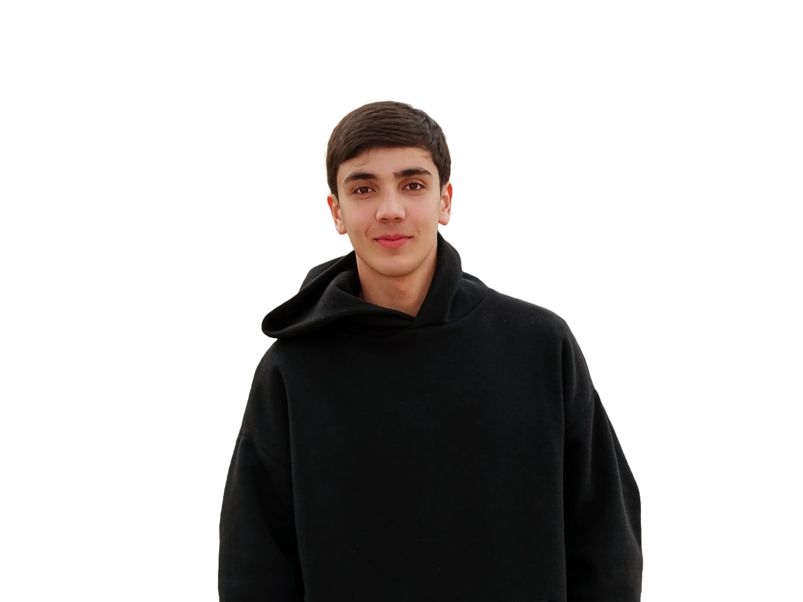

# 🚀 Ysmayyl | Personal Portfolio v2


A comprehensive, fully responsive personal portfolio website migrated from vanilla HTML/JS to a modern **React + Vite** architecture. This project showcases my work in Full-Stack development, featuring advanced animations and a custom-built visitor tracking system.

## 🖼️ Preview



## ✨ Key Features

* **⚛️ Modern Architecture:** Built with React 18 and Vite for blazing fast performance.
* **🎨 Advanced Animations:**
    * **GSAP ScrollTrigger:** Section fade-ins and sticky navbar effects.
    * **SplitType:** Character-by-character text reveal animations in the Hero section.
    * **Smooth Scroll:** Custom programmatic scrolling navigation.
* **📊 Custom Visitor Counter:**
    * **Backend:** PHP API (`get_data.php`) connected to a MySQL database.
    * **Fingerprinting:** Tracks unique visitors using IP + User-Agent hashing (distinguishes between browsers on the same device).
    * **Safe-Update:** Prevents duplicate counts on page reload using LocalStorage and Session logic.
* **📱 Fully Responsive:** Adaptive layout for Mobile, Tablet, and Desktop.

## 🛠️ Tech Stack

**Frontend:**
* React.js
* Vite
* GSAP (GreenSock Animation Platform)
* Split-Type
* CSS3 (Custom properties & Flexbox)

**Backend (Visitor Counter):**
* PHP (REST API)
* MySQL (Database)

## 🚀 Getting Started

To run this project locally, follow these steps:

### 1. Clone the repository
```bash
git clone [https://github.com/smile-web-tech/Portfolio-Web.git](https://github.com/smile-web-tech/Portfolio-Web.git)
